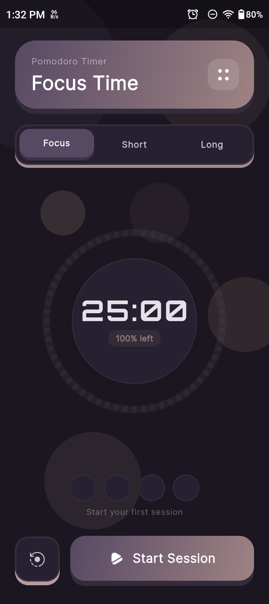

# Priora — Daily Planner App

> A production-quality Flutter productivity app for managing daily tasks, staying focused with Pomodoro timers, and syncing data across devices via Firebase.


---

## Table of Contents

- [Features](#features)
- [Screenshots](#screenshots)
- [Architecture](#architecture)
- [Tech Stack](#tech-stack)
- [Project Structure](#project-structure)
- [Getting Started](#getting-started)
- [Firebase Setup](#firebase-setup)
- [Data Model](#data-model)
- [Providers (State Management)](#providers-state-management)
- [Design System](#design-system)
- [Notifications](#notifications)
- [Data & Privacy](#data--privacy)
- [Roadmap](#roadmap)

---

## Features

### Task Management
- Create, edit, and delete tasks with title, description, due date/time, priority, and category
- **Priority levels** — Low, Medium, High (color-coded)
- **Categories** — Personal, Work, Health, Study, Other (each with emoji + color)
- **Sub-tasks** — Break tasks into smaller checklist items with progress tracking
- Swipe to complete or delete with haptic feedback

### Home & Calendar
- **Calendar view** — Week/month toggle with event dots for days that have tasks
- **Animated time-of-day backgrounds** — starry night, sunrise clouds, sun rays, shooting stars
- **Live Orbitron clock** — real-time display on the home header
- Task list sorted by time, then priority for the selected day

### Pomodoro Timer
- Focus / Short Break / Long Break phases with configurable durations
- Animated segmented ring progress indicator
- Session counter and phase notifications
- Background notification when timer ends

### Search
- Full-text search across task titles and descriptions
- Filter by priority and completion status

### Stats
- Current streak tracker (consecutive days with ≥1 completed task)
- Today / Week / All-time completion rates
- Last 7 days bar chart

### Sync & Auth
- **Google Sign-In** via Firebase Auth
- **Two-way Firestore sync** on login — last-write-wins merge strategy
- **Offline-first** — Hive is always the source of truth; works fully without internet
- Sign out clears local data and Firebase session

### Settings & Onboarding
- Light / Dark / System theme toggle with persistence
- First-launch onboarding walkthrough
- Automatic crash reporting via Firebase Crashlytics

---

## Screenshots

> _(Add screenshots here)_

| Home | Add Task | Pomodoro | Stats |
|------|----------|----------|-------|
|  |  |  |  |

---

## Architecture

Priora follows **Clean Architecture** with **MVVM** in the presentation layer and **Riverpod 2** for reactive state management.

```
┌─────────────────────────────────────────────────┐
│                 Presentation                    │
│   Screens  ──►  Riverpod Providers  ──►  Widgets│
└───────────────────────┬─────────────────────────┘
                        │
┌───────────────────────▼─────────────────────────┐
│                   Domain                        │
│         TaskRepository (interface)              │
└───────────────────────┬─────────────────────────┘
                        │
┌───────────────────────▼─────────────────────────┐
│                    Data                         │
│  TaskLocalSource (Hive) ◄──► TaskRepositoryImpl │
│  FirestoreService (Firebase) — fire-and-forget  │
└─────────────────────────────────────────────────┘
```

### Offline-First Rule

Hive is **always** the source of truth. Firestore sync is fire-and-forget — a cloud failure never blocks or rolls back a local operation.

### Sync Flow

```
Login        →  syncOnLogin()  →  Firestore ↔ Hive two-way merge
Task CRUD    →  Hive (instant) →  Firestore (background)
Logout       →  Hive.clear()  →  Firebase sign out
```

---

## Tech Stack

| Concern | Library | Version |
|---------|---------|---------|
| Framework | Flutter | 3.x |
| State Management | flutter_riverpod | 2.6.1 |
| Local Database | hive_ce + hive_ce_flutter | 2.10.1 / 2.2.0 |
| Routing | go_router | 14.8.1 |
| Auth | Firebase Auth + Google Sign-In | 5.5.0 / 6.2.2 |
| Cloud Sync | cloud_firestore | 5.6.5 |
| Crash Reporting | firebase_crashlytics | 4.3.5 |
| Analytics | firebase_analytics | 11.4.5 |
| Notifications | flutter_local_notifications | 18.0.0 |
| Timezone | timezone + flutter_timezone | 0.9.4 / 5.1.0 |
| Calendar UI | table_calendar | 3.1.3 |
| Fonts | google_fonts (Inter, Orbitron) | 6.2.1 |
| Icons | iconsax_flutter | 1.0.1 |
| Persistence | shared_preferences | 2.3.2 |
| Utilities | uuid, intl, connectivity_plus | latest |

---

## Project Structure

```
lib/
├── main.dart                              # Bootstrap — Hive, Firebase, Notifications
├── firebase_options.dart                  # Auto-generated Firebase config (do not edit)
├── app/
│   ├── app.dart                           # Root MaterialApp.router
│   ├── router/app_router.dart             # GoRouter — routes + redirect logic
│   └── theme/app_theme.dart              # Design system — colors, typography, components
├── core/
│   ├── constants/app_constants.dart       # Box names, app-wide constants
│   ├── utils/date_utils.dart              # Date helpers (dateOnly, isSameDay, formatters)
│   ├── providers/auth_provider.dart       # authStateProvider, currentUserProvider, authSyncProvider
│   ├── services/
│   │   ├── firebase_auth_service.dart     # Google Sign-In / Sign-Out
│   │   ├── firestore_service.dart         # Firestore cloud sync (fire-and-forget)
│   │   ├── notification_service.dart      # Local notifications + scheduling
│   │   └── appwrite_service.dart          # Appwrite sync (optional, config required)
│   └── widgets/
│       ├── surface_3d.dart                # Reusable 3D-effect button/card
│       ├── animated_background.dart       # 6 floating gradient orbs
│       ├── confirm_dialog.dart            # Reusable confirmation dialog
│       ├── app_drawer.dart                # Navigation drawer
│       └── app_toast.dart                 # Animated toast notifications
└── features/
    ├── auth/
    │   └── screens/login_screen.dart      # Google Sign-In UI
    ├── onboarding/
    │   └── screens/onboarding_screen.dart
    ├── tasks/
    │   ├── data/
    │   │   ├── models/task_model.dart              # TaskModel (Hive), SubTask, enums
    │   │   ├── sources/task_local_source.dart       # Hive CRUD wrapper
    │   │   └── repositories/task_repository_impl.dart
    │   ├── domain/
    │   │   └── repositories/task_repository.dart    # Abstract interface
    │   └── presentation/
    │       ├── providers/task_providers.dart         # All task Riverpod providers
    │       ├── screens/
    │       │   ├── home_screen.dart                  # Calendar + task list
    │       │   ├── add_edit_task_screen.dart          # Task CRUD form
    │       │   └── search_screen.dart                # Full-text search
    │       └── widgets/
    │           ├── task_card.dart                    # Task list item (slidable)
    │           └── live_clock_card.dart              # Orbitron real-time clock
    ├── settings/
    │   ├── providers/settings_providers.dart         # ThemeModeNotifier
    │   └── screens/settings_screen.dart
    ├── stats/
    │   └── screens/stats_screen.dart                 # Streak, completion rates, bar chart
    └── pomodoro/
        └── screens/pomodoro_screen.dart              # Timer + segmented ring
```

---

## Getting Started

### Prerequisites

- [Flutter SDK](https://docs.flutter.dev/get-started/install) 3.10 or higher
- Dart 3.8+
- Android device or emulator (min SDK 23 / Android 6.0)
- Java 11+

### Installation

```bash
# 1. Clone the repository
git clone https://github.com/your-username/priora.git
cd priora

# 2. Install dependencies
flutter pub get

# 3. Run in debug mode
flutter run

# 4. Build release APK
flutter build apk --release
```

### Other Commands

```bash
# Analyze code
flutter analyze

# Run tests
flutter test

# Clean build artifacts
flutter clean && flutter pub get
```

---

## Firebase Setup

Firebase is already configured for this project. If you fork and set up your own:

### Steps

1. Create a Firebase project at [console.firebase.google.com](https://console.firebase.google.com)
2. Register your Android app with package name `com.planner.priora`
3. Add your SHA-1 fingerprint to Firebase Console:
   ```bash
   keytool -list -v -keystore ~/.android/debug.keystore -alias androiddebugkey -storepass android -keypass android
   ```
4. Download `google-services.json` and place it in `android/app/`
5. Enable **Google Sign-In** in Firebase Auth → Sign-in methods
6. Create a **Firestore** database in production mode
7. Add Firestore security rules:
   ```
   rules_version = '2';
   service cloud.firestore {
     match /databases/{database}/documents {
       match /users/{userId}/tasks/{taskId} {
         allow read, write: if request.auth != null && request.auth.uid == userId;
       }
     }
   }
   ```
8. Run `flutterfire configure` to regenerate `firebase_options.dart`

### Current Configuration

| Setting | Value |
|---------|-------|
| Firebase Project ID | `priora-app-b7015` |
| Android App ID | `1:260302773984:android:8a830438168cf95125ba85` |
| Min SDK | 23 |
| Package | `com.planner.priora` |

---

## Data Model

### TaskModel

| Field | Type | Notes |
|-------|------|-------|
| `id` | `String` | UUID v4 |
| `title` | `String` | Required |
| `description` | `String` | Optional, defaults to `''` |
| `dueDate` | `DateTime` | Date-only (time zeroed via `AppDateUtils.dateOnly()`) |
| `dueTimeMinutes` | `int?` | Minutes since midnight (e.g. 9:30 AM = 570) |
| `priority` | `TaskPriority` | `low` / `medium` / `high` |
| `category` | `TaskCategory` | `personal` / `work` / `health` / `study` / `other` |
| `isCompleted` | `bool` | |
| `isSynced` | `bool` | Firestore sync flag |
| `subtasks` | `List<SubTask>` | Each has `id`, `title`, `isDone` |
| `createdAt` | `DateTime` | |
| `updatedAt` | `DateTime` | |

### Key Convention

`dueDate` is always stored as midnight UTC (date-only). `dueTimeMinutes` is stored separately. **Never** mix date + time in a single `DateTime` field.

### Always Use `copyWith`

```dart
// ✅ Correct
final updated = task.copyWith(isCompleted: true, updatedAt: DateTime.now());
await repo.updateTask(updated);

// ❌ Wrong — never mutate directly
task.isCompleted = true;
```

---

## Providers (State Management)

### Task Providers

| Provider | Type | Purpose |
|----------|------|---------|
| `taskLocalSourceProvider` | `Provider` | Singleton `TaskLocalSource` (Hive) |
| `taskRepositoryProvider` | `Provider` | Singleton `TaskRepositoryImpl` |
| `tasksStreamProvider` | `StreamProvider<List<TaskModel>>` | Live Hive stream |
| `selectedDateProvider` | `StateProvider<DateTime>` | Calendar selection |
| `calendarFormatProvider` | `StateProvider<CalendarFormat>` | Week/month toggle |
| `tasksForSelectedDateProvider` | `Provider<List<TaskModel>>` | Filtered + sorted for selected date |
| `searchQueryProvider` | `StateProvider<String>` | Search input |
| `filteredTasksProvider` | `Provider<List<TaskModel>>` | Search results |
| `taskCountByDayProvider` | `Provider<Map<DateTime, int>>` | Calendar event dots |
| `appStatsProvider` | `Provider<AppStats>` | Streak, rates, last 7 days |

### Auth Providers

| Provider | Type | Purpose |
|----------|------|---------|
| `authStateProvider` | `StreamProvider<User?>` | Firebase auth stream |
| `currentUserProvider` | `Provider<User?>` | Current user (nullable) |
| `authSyncProvider` | `Provider<void>` | Triggers Firestore ↔ Hive sync on login |

### Settings Providers

| Provider | Type | Purpose |
|----------|------|---------|
| `themeModeProvider` | `StateNotifierProvider<ThemeModeNotifier, ThemeMode>` | Persisted theme |
| `onboardingCompleteProvider` | `FutureProvider<bool>` | Reads SharedPreferences |

---

## Design System

### Color Palette

| Name | Hex | Usage |
|------|-----|-------|
| `deepPlum` | `#574964` | Primary / buttons / drawer |
| `mauve` | `#9F8383` | Secondary text / borders |
| `dustyPink` | `#C8AAAA` | Tertiary / subtle UI |
| `peach` | `#FFDAB3` | Accent / highlights |

### Priority Colors

| Priority | Hex | Color |
|----------|-----|-------|
| High | `#C06A6A` | Red |
| Medium | `#D99A5B` | Orange |
| Low | `#7E9C7E` | Green |

### Typography

- **Body / UI** — Inter (Google Fonts)
- **Clock / Monospace** — Orbitron (Google Fonts) — used in LiveClockCard and Pomodoro timer

### Surface3D Widget

Core reusable component that creates a hard-edged 3D press effect:

```dart
Surface3D(
  color: AppTheme.deepPlum,
  edgeColor: Surface3D.darken(AppTheme.deepPlum, 0.4),
  depth: 7,
  borderRadius: 20,
  onTap: () {},
  child: Text('Press Me'),
)
```

---

## Notifications

Priora schedules timezone-aware local notifications for tasks with a set time.

| Method | Description |
|--------|-------------|
| `NotificationService.init()` | Initialize channels and timezone |
| `NotificationService.requestPermissions()` | Request Android/iOS permission |
| `NotificationService.scheduleTaskReminder(task)` | Schedule reminder; skips past times |
| `NotificationService.cancelTaskReminder(taskId)` | Cancel scheduled reminder |

- **Channel:** `task_reminders` (high priority)
- **Android alarm type:** `exactAllowWhileIdle`
- Notification ID is derived from the task UUID for consistency across reschedules

---

## Routes

| Route | Path | Screen |
|-------|------|--------|
| `AppRoutes.login` | `/login` | LoginScreen |
| `AppRoutes.onboarding` | `/onboarding` | OnboardingScreen |
| `AppRoutes.home` | `/` | HomeScreen |
| `AppRoutes.newTask` | `/task/new` | AddEditTaskScreen |
| `AppRoutes.editTask` | `/task/edit` | AddEditTaskScreen |
| `AppRoutes.search` | `/search` | SearchScreen |
| `AppRoutes.settings` | `/settings` | SettingsScreen |
| `AppRoutes.stats` | `/stats` | StatsScreen |
| `AppRoutes.pomodoro` | `/pomodoro` | PomodoroScreen |

**Redirect Logic:**
1. Onboarding incomplete → `/onboarding`
2. Logged-in user on `/login` → `/`
3. Guest mode is allowed — no forced auth redirect

---

## Data & Privacy

- Tasks are stored **locally on-device** using Hive
- If signed in, tasks sync to **Firebase Firestore** under the user's own document path: `users/{uid}/tasks/{taskId}`
- Signing out **clears all local data** from the device
- **Guest mode** keeps data local only — no cloud backup or cross-device sync
- Crash reports are sent to Firebase Crashlytics (anonymized stack traces)

---

## Common Issues

| Error | Cause | Fix |
|-------|-------|-----|
| `PlatformException channel-error firebase_core` | `minSdk` too low | Set `minSdk = 23` in `android/app/build.gradle.kts` |
| `oauth_client empty` in google-services.json | SHA-1 fingerprint not added | Add SHA-1 in Firebase Console → re-download `google-services.json` |
| `DefaultFirebaseOptions not found` | Missing `firebase_options.dart` | Run `flutterfire configure` |
| Hive adapter not found | Adapter not registered | Register in `main.dart` before `openBox()` |
| Notifications not firing | Past time or permissions denied | Check `dueTimeMinutes` > current time and verify permissions |

---

## Roadmap

- [ ] Widget for home screen (Android)
- [ ] Task recurrence (daily / weekly)
- [ ] iOS support and App Store release
- [ ] Appwrite sync as alternative to Firebase
- [ ] Unit and widget test coverage
- [ ] Task sharing / collaboration
- [ ] Export tasks to CSV / PDF

---

## License

This project is licensed under the MIT License. See [LICENSE](LICENSE) for details.
